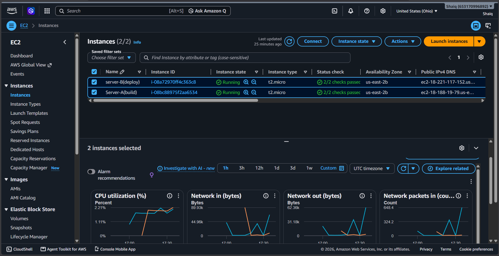
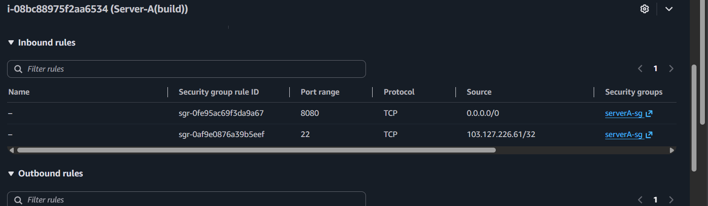
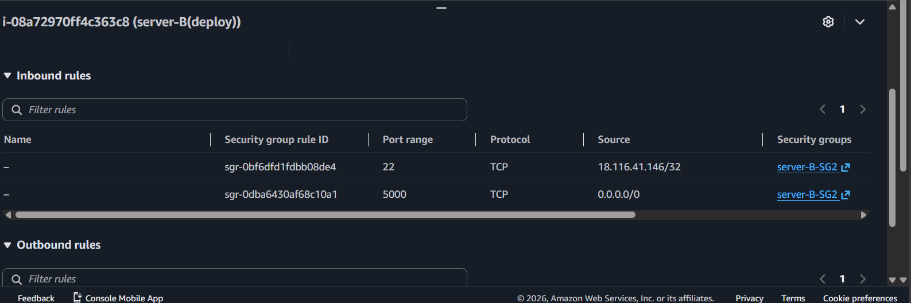
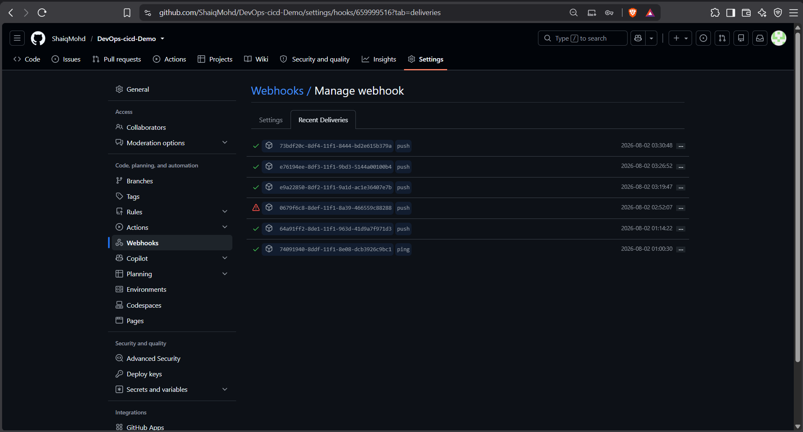
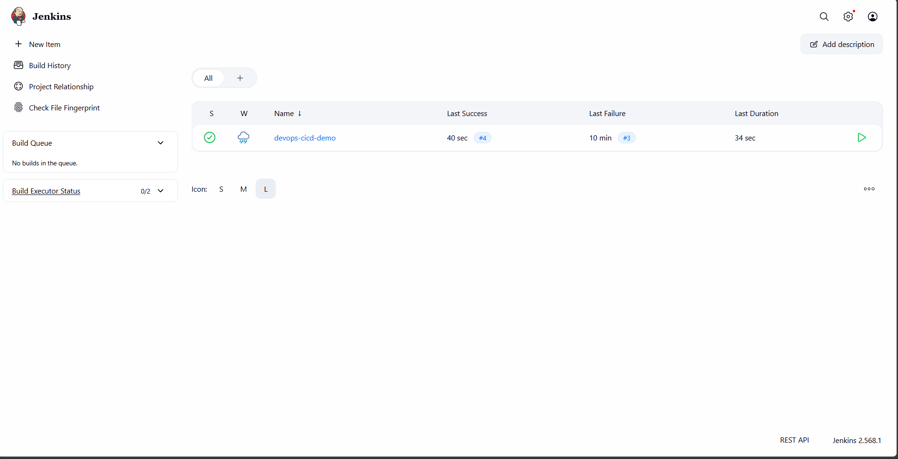
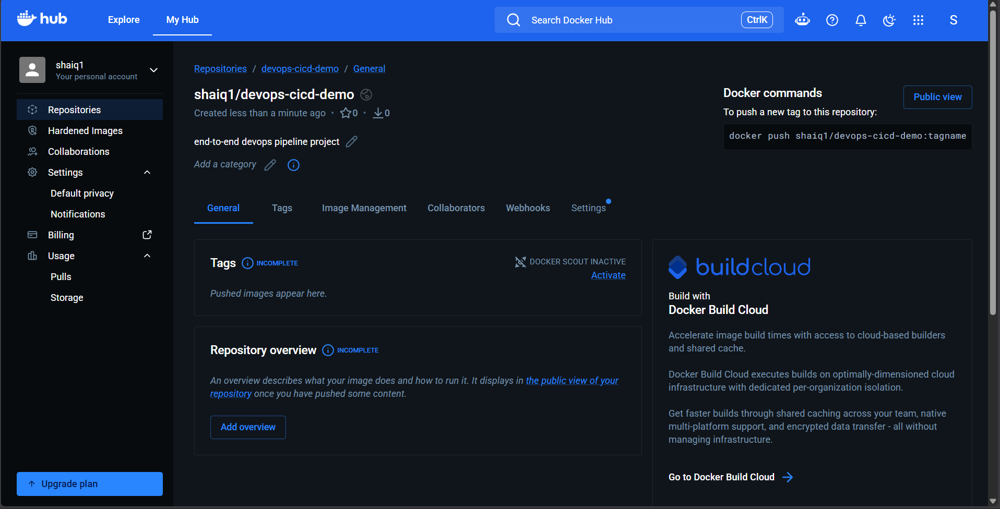

# End-to-End DevOps CI/CD Deployment Pipeline

A fully automated CI/CD pipeline that builds, containerizes, and deploys a Python Flask application — triggered automatically on every `git push`.

**Stack:** Jenkins · GitHub · Docker · Ansible · AWS EC2 (Linux)

---

## Architecture

```
Developer pushes code to GitHub
        │
        ▼  (webhook fires instantly)
   Jenkins Server (Server A)
        │
        ├─ Stage 1: Checkout code from GitHub
        ├─ Stage 2: Build Docker image
        ├─ Stage 3: Push image to Docker Hub
        └─ Stage 4: Run Ansible playbook
                        │
                        ▼
              Deployment Server (Server B)
              Ansible pulls new image →
              stops old container →
              starts new container
```

A GitHub push triggers a Jenkins job via webhook. Jenkins builds and pushes a Docker image to Docker Hub, then hands off to Ansible, which handles the actual deployment on a separate Linux server. Jenkins owns integration/build; Ansible owns configuration/deployment — keeping the two concerns cleanly separated.

---

## What This Project Demonstrates

- **CI/CD pipeline automation** using Jenkins, triggered automatically by GitHub push events via webhooks
- **Containerization** of a Python Flask application using Docker, with versioned image tagging via Jenkins build numbers
- **Configuration management and automated deployment** using Ansible playbooks, run against a remote Linux server over SSH
- **Infrastructure setup on Linux** — two AWS EC2 instances, security group configuration, SSH key-based trust between servers, and system-level troubleshooting (service-user permissions, disk/swap thresholds)

---

## Project Structure

```
devops-cicd-demo/
├── app.py              # Flask application
├── requirements.txt    # Python dependencies
├── Dockerfile           # Container build definition
├── Jenkinsfile          # CI/CD pipeline definition
├── inventory.ini        # Ansible inventory (deployment target)
├── deploy.yml            # Ansible playbook for deployment
└── screenshots/          # Pipeline evidence (below)
```

---

## Infrastructure

Two AWS EC2 (Ubuntu) instances, each with a scoped-down security group:

| Server | Role | Software |
|---|---|---|
| Server A (build) | CI/CD orchestration | Jenkins, Docker, Ansible |
| Server B (deploy) | Deployment target | Docker (runs the live app container) |


*Both EC2 instances up and healthy, passing status checks (2/2), with Jenkins on Server A and the deployment target on Server B.*

### Security Group Rules

Access is scoped per-server rather than left wide open:


*Server A (build): port 8080 open for the Jenkins UI and GitHub webhook, SSH (22) restricted to a single known IP.*


*Server B (deploy): SSH (22) restricted specifically to Server A's IP (not left open to the internet), port 5000 open for the deployed application.*

---

## GitHub Webhook → Jenkins Trigger

A webhook on the GitHub repository fires on every push to `main`, triggering the Jenkins pipeline automatically — no manual builds needed.


*Recent Deliveries showing successful (green) webhook triggers from push events, hitting Jenkins' `/github-webhook/` endpoint in real time.*

---

## CI/CD Pipeline in Action

The Jenkins pipeline runs four stages on every triggered build:

1. **Checkout** — pulls the latest code from GitHub
2. **Build Docker Image** — builds and tags the image with the Jenkins build number
3. **Push to Docker Hub** — pushes both the versioned and `latest` tags
4. **Deploy with Ansible** — runs a playbook against the deployment server to pull the new image and restart the container


*Jenkins job dashboard showing a successful build (#4, green) after resolving an earlier failure — proof of iterative debugging, not a lucky first run.*


*Console output confirming the deployed container is live: `curl` returns the expected response, and `docker ps -a` shows the pipeline-deployed container running on port 5000.*

---

## Docker Hub

Each successful build pushes a new versioned image to Docker Hub, tagged with the Jenkins build number for traceability and rollback.


*The `devops-cicd-demo` repository on Docker Hub, receiving images pushed automatically by the pipeline.*

---

## Key Engineering Decisions & Challenges Solved

- **Service-user SSH trust:** Jenkins runs pipeline steps as its own system user (`jenkins`), not the personal `ubuntu` account. A dedicated passphrase-free SSH keypair was generated specifically for the `jenkins` user, with its public key added to the deployment server and its known_hosts pre-seeded — required for the Ansible stage to run non-interactively inside the pipeline.
- **Resource-constrained infrastructure:** Running Jenkins and Docker on a small EC2 instance surfaced real memory and disk-threshold issues — Jenkins' built-in node monitor took the executor offline due to low free space on `/tmp`, and the instance had 0B swap configured. Diagnosed and resolved by adding 2GB of swap and adjusting Jenkins' monitor thresholds to match actual instance limits.
- **Repository signing key rotation:** Jenkins rotated its Debian/Ubuntu package signing key mid-project; identified and resolved a `NO_PUBKEY` apt error by fetching the current key rather than a stale, commonly-referenced one.
- **Least-privilege network access:** Server-to-server SSH access is scoped to specific security-group sources rather than left open, and the `jenkins` system user's Docker/SSH permissions were granted explicitly rather than broadly.
- **Elastic IP for stability:** After an instance restart broke the webhook URL and SSH trust (both tied to a dynamic public IP), an Elastic IP was allocated to keep Server A's address permanent.

---

## Future Improvements

- Blue-green or rolling deployment (run new container on an alternate port behind a reverse proxy, switch traffic once healthy, then retire the old container) for zero-downtime deploys
- Ansible Vault for encrypting sensitive variables instead of plain credentials
- Automated rollback stage in Jenkins, parameterized to redeploy a previous image tag
- Move from a single build agent to distributed Jenkins agents for better resource isolation
